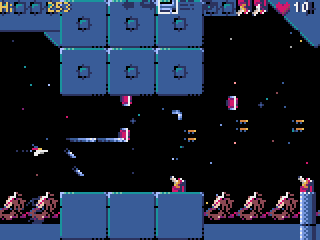
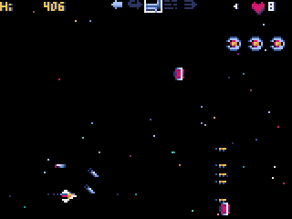

# code-of-python

[[日本語](README.md) | [Engligh](README.ENG.md)  ]








Shooting game-like? It's not finished, but...

## How to Install
## Windows


First install [Python3](https://www.python.org/) (version 3.6.8 or higher).

Then, install Pyxel (version  2.0.0 or higher) from the command prompt with the following `pip` command.

```sh
pip install -U pyxel
```

Further on, install pygame, which is used for background music playback, from the command prompt with the following `pip` command.

```sh
pip install pygame 
```
Download the files in the source folder and after without changing the folder structure.

From a command prompt, type and execute the following

```sh
python code-of-python.py
```
             Spacebar to fire shots and missiles
             Gamepad A button to fire a shot
                          Press B to launch missiles.
                          Y button to switch subweapons
             BACK button to change the speed of your plane (3 levels)
             LEFT-SHOULDER button to change the close style
             Adjustment of fixclaw spacing with RIGHT-SHOULDER button

You can pause the game by pressing the TAB key or START on the gamepad.

I am using music by [PANICPUMPKIN](http://pansound.com/panicpumpkin/) for background music.


